# 💳 Credit Risk Prediction ML System

⭐ **If you find this project useful, consider giving it a star!**


Production-grade end-to-end machine learning system for **personal loan risk assessment** with
a **3-tier decision engine (APPROVE / REVIEW / DECLINE)**, probability calibration, SHAP explainability,
Champion vs Challenger system, and real-time API + monitoring dashboard.

---

## 🚀 Project Overview

This project builds a complete **Fintech-grade Credit Risk System** with:

* Automated ML training pipeline (13 models, hyperparameter tuning)
* Rich feature engineering — 12 engineered features (debt ratios, digital engagement, income interactions)
* SMOTENC for class imbalance (handles mixed feature types — binary + continuous)
* Dual ColumnTransformer — scaled preprocessor for linear models, unscaled for tree models
* Probability calibration (holdout isotonic regression)
* 3-tier risk decision engine with hard + soft business rules
* Champion vs Challenger model promotion system (3 promotion gates)
* SHAP explainability (TreeExplainer)
* MLflow experiment tracking
* PSI drift monitoring
* Leakage detection before training
* 25 pytest unit tests with coverage report
* Real-time FastAPI + Applicant Simulator
* Streamlit monitoring dashboard with real-time alerts

---

## 💡 Why This Project Matters

Traditional credit scoring systems lack transparency and adaptability.
This system combines ML + business rules + monitoring to simulate
real-world banking decision pipelines.

---

## 🏗 System Architecture

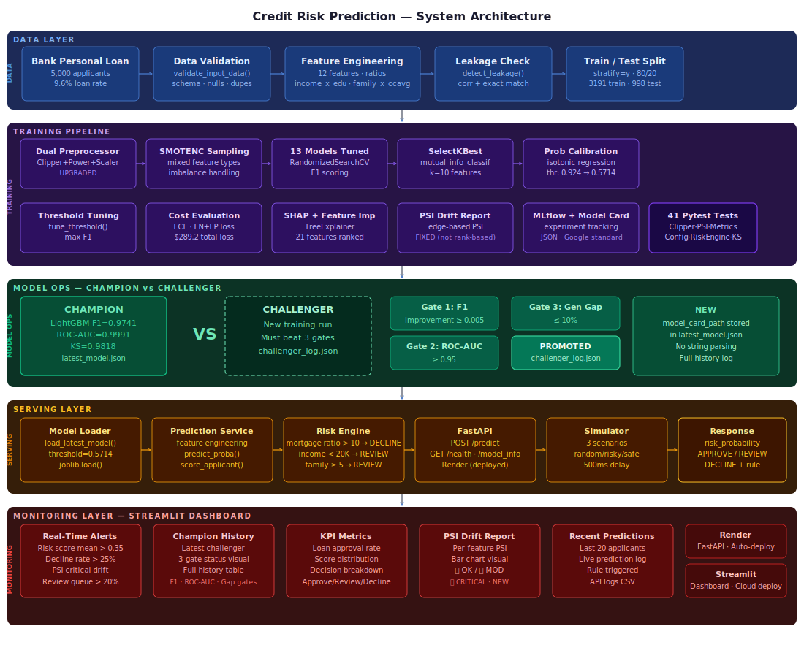


## 🌐 Live Demo

🚀 **Credit Risk API (Live)**
👉 https://YOUR-RENDER-URL.onrender.com

📊 **Monitoring Dashboard (Live)**
👉 https://YOUR-STREAMLIT-URL.streamlit.app

📄 **API Docs:**
👉 https://YOUR-RENDER-URL.onrender.com/docs

---

## 📊 Monitoring Dashboard

Real-time monitoring dashboard built using **Streamlit**.

---

### 🎬 System Demo (End-to-End Flow)

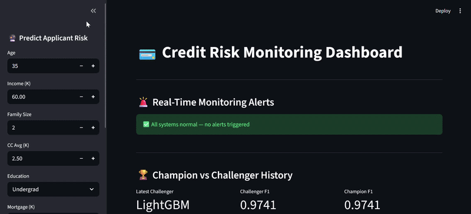

---

### 🖥️ Full Dashboard UI

Real-time applicant risk scoring + Champion vs Challenger history.

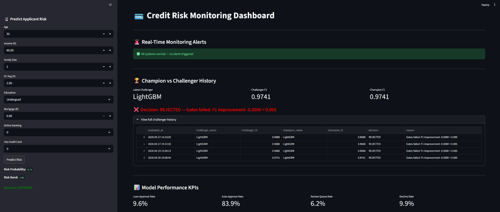

---

### 📈 Risk Score and Decision Distribution

Risk probability distribution with LOW / MEDIUM / HIGH boundaries and decision breakdown.

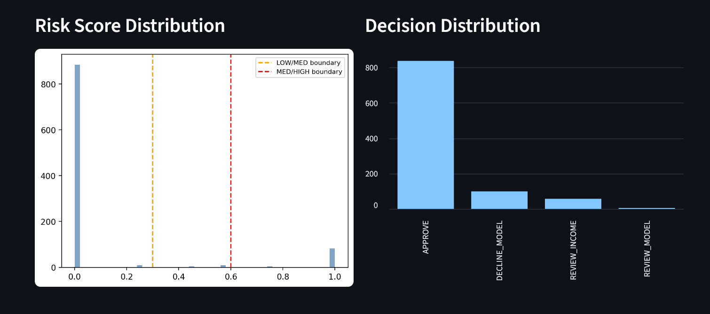

---

### 📊 Risk Band and Score Statistics

LOW / MEDIUM / HIGH segmentation with score statistics table.

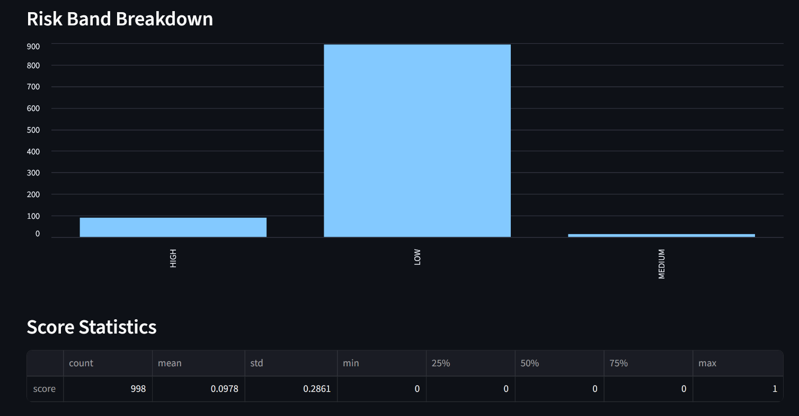

---

### 📉 Feature Drift Report (PSI) and Recent Predictions

PSI drift monitoring with 🔴🟡🟢 status flags and live prediction log.

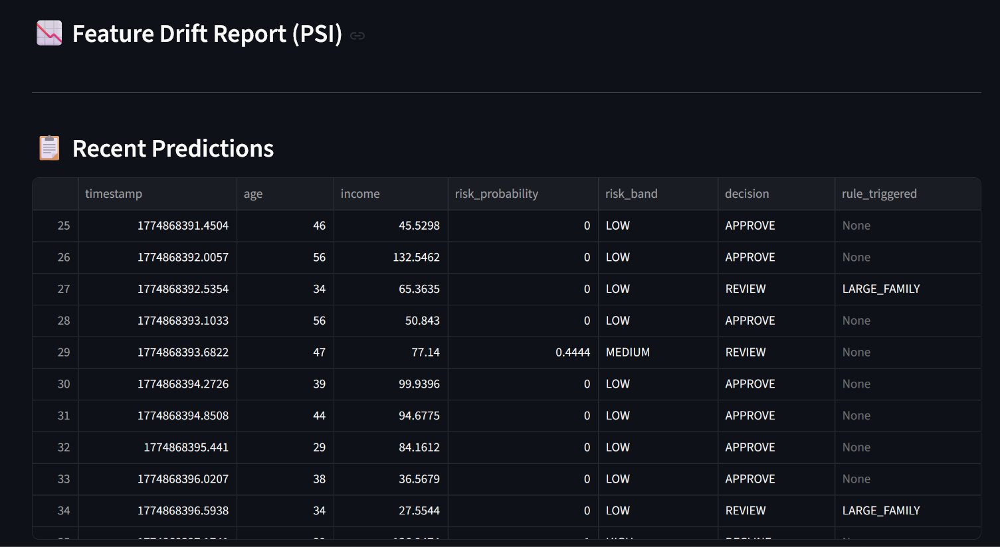

---

### 🔍 What This Dashboard Helps With

* Monitor risk score distribution shifts over time
* Track approval vs rejection vs review rates
* Detect feature distribution drift (PSI)
* Compare champion vs challenger model versions
* Trigger real-time alerts on anomalous patterns
* View recent predictions with rule trigger details

---

## 📊 Model Performance Summary

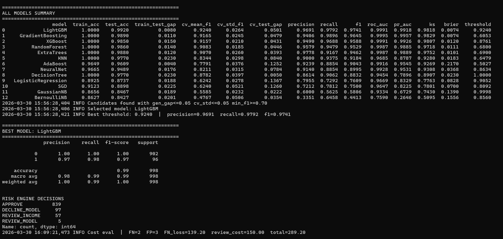

---

### 🔍 Detailed Metrics

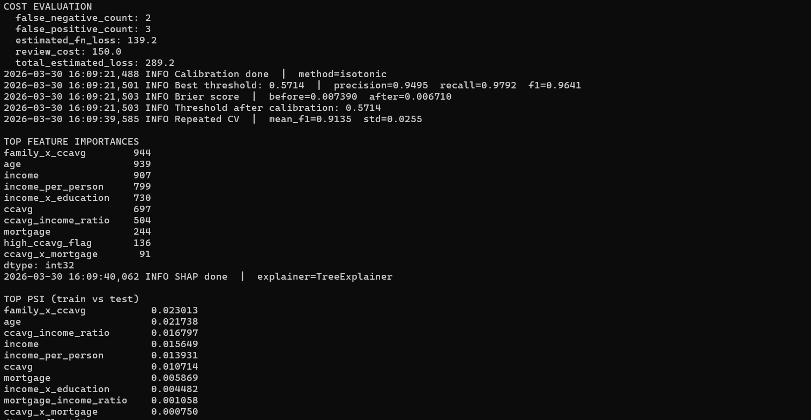

---

## 🆚 Champion vs Challenger

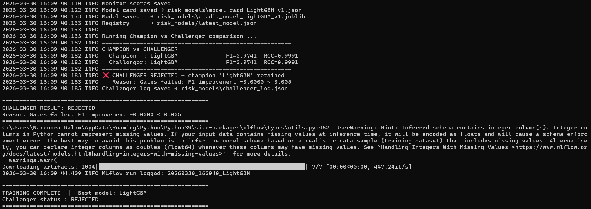

---

## 🧪 Test Coverage

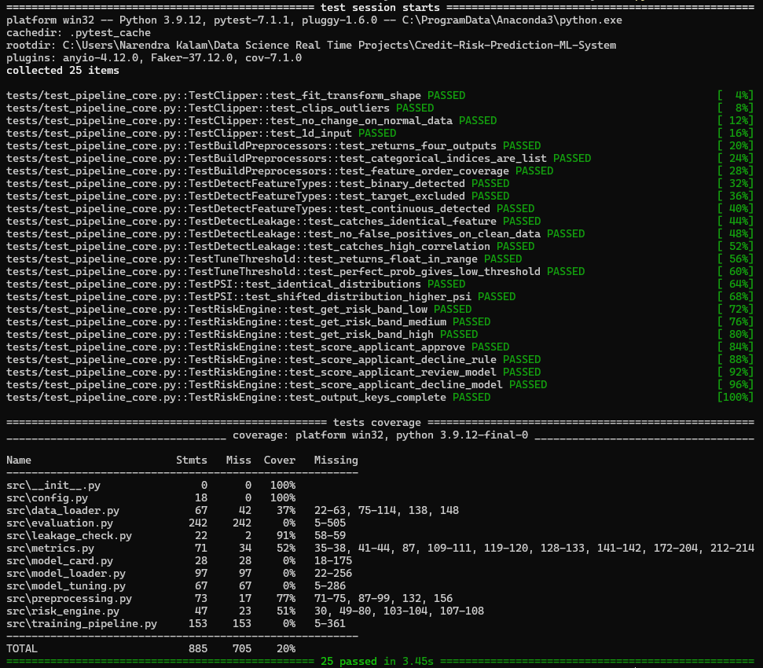

---

## 🌐 API Prediction Response

Example response from real-time FastAPI endpoint.

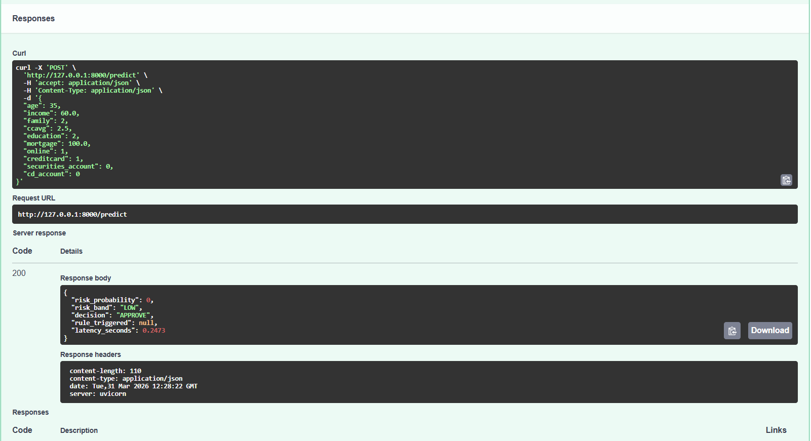

---

## 🎯 Risk Decision Engine

Unlike simple fraud detection (BLOCK / APPROVE), this system uses a
**3-tier fintech decision engine**:

| Decision | Trigger |
|----------|---------|
| `APPROVE` | Low risk probability + no rule flags |
| `REVIEW`  | Borderline ML score OR soft rule (low income / large family) |
| `DECLINE` | High risk probability OR hard rule (extreme mortgage/income ratio) |

Rules are checked **before** ML — matching real bank underwriting systems.

---

## 🏆 Champion vs Challenger System

Every new training run is compared against the production champion using 3 promotion gates:

| Gate | Condition |
|------|-----------|
| F1 Improvement | Challenger must beat champion by ≥ 0.5% |
| ROC-AUC | Challenger must have ROC-AUC ≥ 0.95 |
| Generalization Gap | Train-test gap must be ≤ 10% |

Results logged to `risk_models/challenger_log.json` and visible in dashboard.

---

## 📈 Model Results (LightGBM — Best Model)

| Metric | Value |
|--------|-------|
| F1 Score | 0.9741 |
| ROC-AUC | 0.9991 |
| KS Statistic | 0.9818 |
| PR-AUC | 0.9918 |
| Brier Score | 0.0074 |
| Precision | 0.9691 |
| Recall | 0.9792 |

---

## 📊 All Models Evaluated

LR · KNN · SGD · GaussianNB · DecisionTree · RandomForest · ExtraTrees ·
GradientBoosting · AdaBoost · XGBoost · LightGBM · CatBoost · MLP (NeuralNet)

---

## 📈 Evaluation Metrics Used

| Metric | Description |
|--------|-------------|
| F1 Score | Primary selection metric |
| ROC-AUC | Discrimination ability |
| PR-AUC | Precision-Recall balance |
| KS Statistic | Separation between risk classes |
| Brier Score | Probability calibration quality |
| Recall@5% | Coverage of top-risk applicants |
| Lift@5% | Lift over random baseline |
| Train-Test Gap | Overfitting check |
| CV Stability | Variance across folds |

---

## ⚡ Real-Time Prediction API

### Run API locally

```bash
python scripts/run_api.py
```

### Endpoint

```
POST /predict
```

### Example Request

```json
{
  "age": 35,
  "income": 60.0,
  "family": 2,
  "ccavg": 2.5,
  "education": 2,
  "mortgage": 100.0,
  "online": 1,
  "creditcard": 1,
  "securities_account": 0,
  "cd_account": 0
}
```

### Example Response

```json
{
  "risk_probability": 0.1823,
  "risk_band": "LOW",
  "decision": "APPROVE",
  "rule_triggered": null,
  "latency_seconds": 0.045
}
```

---

## 🔁 Applicant Simulator

```bash
python scripts/run_simulation.py
```

Supports 3 scenarios: `random`, `risky`, `safe`

---

## ⚙ How to Run

### 1. Train Model

```bash
python scripts/train_model.py
```

### 2. Start API

```bash
python scripts/run_api.py
```

### 3. Run Simulator

```bash
python scripts/run_simulation.py
```

### 4. Start Dashboard

```bash
python scripts/run_dashboard.py
```

---

## 📂 Project Structure

```
credit-risk-ml-system/
│
├── src/
│   ├── config.py              ← constants + risk band thresholds
│   ├── data_loader.py         ← validation + feature engineering
│   ├── preprocessing.py       ← Clipper + ColumnTransformer builders
│   ├── model_tuning.py        ← model grids + tune_models + MLP
│   ├── metrics.py             ← PSI, KS, ECL cost eval, threshold tuning
│   ├── risk_engine.py         ← 3-tier decision engine
│   ├── evaluation.py          ← eval dashboard, calibration, SHAP, save
│   ├── leakage_check.py       ← pre-training leakage detection
│   ├── model_card.py          ← build + save structured model card JSON
│   ├── model_loader.py        ← champion load + challenger comparison
│   └── training_pipeline.py  ← full orchestration
│
├── services/
│   └── prediction_service.py
│
├── serving/
│   └── credit_risk_api.py    ← FastAPI endpoints
│
├── monitoring/
│   └── monitoring_dashboard.py
│
├── simulation/
│   └── applicant_simulator.py
│
├── scripts/
│   ├── train_model.py
│   ├── run_api.py
│   ├── run_dashboard.py
│   └── run_simulation.py
│
├── tests/
│   └── test_pipeline_core.py ← 25 pytest unit tests
│
├── notebooks/
│   └── credit_risk_eda.ipynb ← 22-step professional EDA
│
├── risk_models/
│   ├── credit_model_LightGBM_v1.joblib
│   ├── latest_model.json
│   ├── model_card_LightGBM_v1.json
│   ├── challenger_log.json
│   ├── model_experiment_results.csv
│   ├── monitor_scores.csv
│   └── feature_drift_report.csv
│
├── data/
│   └── sample_credit_data_balanced.csv
│
├── docs/
│   ├── screenshots/
│   └── gifs/
│
├── requirements.txt
├── runtime.txt
├── .gitignore
└── README.md
```

---

## 🧪 Running Tests

```bash
# Run all tests
pytest tests/ -v

# With coverage report
pytest tests/ -v --cov=src --cov-report=term-missing
```

Tests cover: `Clipper`, `build_preprocessors`, `detect_feature_types`,
`detect_leakage`, `tune_threshold`, `psi`, `get_risk_band`, `score_applicant`

---


## 🛠 Tech Stack

Python · Scikit-Learn · XGBoost · LightGBM · CatBoost · imbalanced-learn ·
FastAPI · Streamlit · SHAP · MLflow · Pytest · Pandas · NumPy · Seaborn · Render · Streamlit Cloud

---

## 👤 Author

**Narendra Kalam**

Machine Learning & Data Science

📧 kalamnarendra2001@gmail.com

🔗 https://www.linkedin.com/in/narendra-kalam